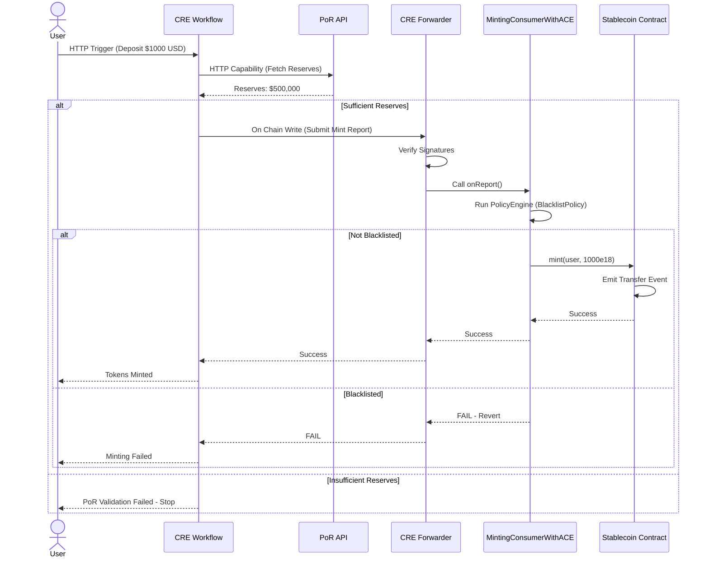
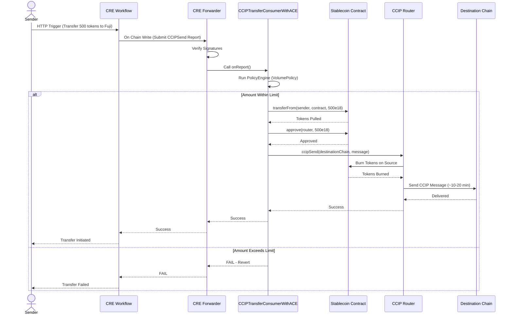

# Chainlink Runtime Environment (CRE) - Stablecoin Demo

A demo stablecoin issuance system demonstrating **Chainlink Runtime Environment (CRE)** integrated with **Proof of Reserve (PoR)**, **Automated Compliance Engine (ACE)**, and **Cross-Chain Interoperability Protocol (CCIP)**.

---

## Canonical Repository

This repository is the **canonical and fully DevRel-maintained source of truth** for these templates.

The code originally lived in [`smartcontractkit/cre-demo-dapps`](https://github.com/smartcontractkit/cre-demo-dapps), and was later consolidated here to provide a single, long-term maintained codebase.

All ongoing development and updates now happen exclusively in this repository, in order to avoid fragmentation and to preserve discoverability via search engines and AI tooling.

---

**⚠️ DISCLAIMER**

This tutorial represents an educational example to use a Chainlink system, product, or service and is provided to demonstrate how to interact with Chainlink's systems, products, and services to integrate them into your own. This template is provided "AS IS" and "AS AVAILABLE" without warranties of any kind, it has not been audited, and it may be missing key checks or error handling to make the usage of the system, product or service more clear. Do not use the code in this example in a production environment without completing your own audits and application of best practices. Neither Chainlink Labs, the Chainlink Foundation, nor Chainlink node operators are responsible for unintended outputs that are generated due to errors in code.

---

## Table of Contents

* [What This Demo Does](#what-this-demo-does)
* [How It Works](#how-it-works)
* [Repository Structure](#repository-structure)
* [Prerequisites](#prerequisites)
* [Getting Started](#getting-started)
  * [Option 1: Test with Pre-Deployed Contracts (Fastest)](#option-1-test-with-pre-deployed-contracts-fastest)
  * [Option 2: Deploy Your Own](#option-2-deploy-your-own)
* [CRE + PoR + ACE + CCIP Capabilities](#cre--por--ace--ccip-capabilities)
* [Observability Tips](#observability-tips)
* [Troubleshooting](#troubleshooting)
* [Security Considerations](#security-considerations)
* [License](#license)

---

## What This Demo Does

This repository demonstrates how financial institutions can build a **secure, compliant, multi-chain stablecoin** using Chainlink's complete service stack. The demo progresses through three phases:

**Phase 1:** Traditional banks trigger stablecoin minting and redemption using SWIFT-style messages via HTTP. CRE orchestrates the workflow, validates messages, and submits cryptographically-signed reports to mint or burn tokens on-chain.

**Phase 2:** Cross-chain stablecoin transfers using CCIP. Users can transfer tokens between Ethereum Sepolia and Avalanche Fuji testnets with automatic token burning on the source chain and minting on the destination.

**Phase 3:** Advanced multi-service integration (production requires additional audits and hardening) that combines:

1. **Proof of Reserve (PoR)** - Validates sufficient off-chain reserves before minting (prevents over-collateralization issues)
2. **Automated Compliance Engine (ACE)** - Enforces on-chain policies like address blacklisting for regulatory compliance
3. **CCIP** - Secure cross-chain transfers with compliance checks at both mint and transfer stages

**Key Technologies:**

* **CRE (Chainlink Runtime Environment)** - Orchestrates multi-service workflows with DON consensus
* **PoR (Proof of Reserve)** - External reserve validation
* **ACE (Automated Compliance Engine)** - On-chain policy enforcement
* **CCIP (Cross-Chain Interoperability Protocol)** - Secure token bridging

---

## How It Works

### Flow 1: Stablecoin Issuance with PoR + ACE



### Flow 2: Cross-Chain Transfer with ACE



---

## Repository Structure

### 1. Workflows Directory

Three progressive CRE workflows demonstrating increasing complexity:

* **`bank-stablecoin-workflow/`** - Phase 1: Basic mint/redeem operations
* **`ccip-transfer-workflow/`** - Phase 2: Cross-chain CCIP transfers
* **`bank-stablecoin-por-ace-ccip-workflow/`** - Phase 3: PoR + ACE + CCIP integration

### 2. Contracts Directory

Smart contracts for stablecoin and ACE integration:

* **`StablecoinERC20.sol`** - Core stablecoin with mint/burn roles
* **`MintingConsumer.sol`** - Phase 1: Basic CRE consumer
* **`CCIPTransferConsumer.sol`** - Phase 2: CCIP consumer
* **`MintingConsumerWithACE.sol`** - Phase 3: ACE-protected mint consumer
* **`CCIPTransferConsumerWithACE.sol`** - Phase 3: ACE-protected CCIP consumer
* **`policies/AddressBlacklistPolicy.sol`** - ACE blacklist policy
* **`extractors/UnifiedExtractor.sol`** - ACE parameter extractor for both mint and CCIP operations

### 3. Scripts Directory

Foundry deployment scripts for ACE infrastructure:

* **`DeployACESystem.s.sol`** - Deploy PolicyEngine, policies, and extractors
* **`DeployACEConsumers.s.sol`** - Deploy ACE-protected consumers
* **`ConfigureACEWithConstants.s.sol`** - Configure ACE (attach policies and extractors)

---

## Prerequisites

To run this demo, you'll need:

**Tools:**

* Git
* [Foundry](https://book.getfoundry.sh/getting-started/installation) (`forge`, `cast`, `anvil`)
* [Bun](https://bun.sh/) (JavaScript runtime and package manager)
* [Chainlink Runtime Environment CLI](https://docs.chain.link/cre)

**Testnet Funds:**

* ETH on Sepolia testnet ([Chainlink Faucet](https://faucets.chain.link))
* ETH on Fuji testnet
* LINK tokens

**For Full Deployment:**

* Private key with testnet ETH
* RPC endpoints (free from [Alchemy](https://www.alchemy.com/) or public RPCs)

---

## Getting Started

### Option 1: Test with Pre-Deployed Contracts (Fastest)

This repo includes pre-deployed Phase 3 contracts on Sepolia for immediate testing.

**Pre-Deployed Contracts:**

| Contract | Sepolia Testnet | Fuji Testnet |
| -------- | --------------- | ------------ |
| **StablecoinERC20** | [`0xF9ec...dE8e`](https://sepolia.etherscan.io/address/0xF9ec4EE99B992A6AA5C70619092E2c605480dE8e) | [`0x497C...aa71`](https://testnet.snowtrace.io/address/0x497C61Ed4e738410a25eD9b3a2F071D1606eaa71) |
| **BurnMintTokenPool** | [`0x37Be...E2D6`](https://sepolia.etherscan.io/address/0x37BeD199bBDCfd86B01989bE271EC022430FE2D6) | [`0xf44f...03D6`](https://testnet.snowtrace.io/address/0xf44f0Ee3fE6563c37222CaFa08aBC00B078F03D6) |
| **PolicyEngine** | [`0x697B...5CA1`](https://sepolia.etherscan.io/address/0x697B79dFdbe5eD6f9d877bBeFac04d7A28be5CA1) | - |
| **AddressBlacklistPolicy** | [`0xA5Db...c3A6`](https://sepolia.etherscan.io/address/0xA5Db8159CD4084570FD248A7ec8457B3E348c3A6) | - |
| **VolumePolicy** (100-10k range) | [`0xfd09...2b56`](https://sepolia.etherscan.io/address/0xfd09CF4Db1eB6e8a75653C29816e56095A3B2b56) | - |
| **UnifiedExtractor** | [`0x8266...d0c5`](https://sepolia.etherscan.io/address/0x8266045F895e2C3A81476Ba12de0A9DbFf94d0c5) | - |
| **MintingConsumerWithACE** | [`0x24c0...F0Cc`](https://sepolia.etherscan.io/address/0x24c0f5C1A286Fbd27A730303a1a845b4cf85F0Cc) | - |
| **CCIPTransferConsumerWithACE** | [`0xFa03...1cD5`](https://sepolia.etherscan.io/address/0xFa031de805af3a9A72D37f57a01634ADF4a61cD5) | - |

**Test Phase 3 (PoR + ACE) Immediately:**

**Step 1: Create configuration files**

```bash
cp .env.example .env
cp secrets.yaml.example secrets.yaml
```

**Step 2: Set project root**

```bash
export CRE_PROJECT_ROOT=$(pwd)
```

**Step 3: Install workflow dependencies**

```bash
cd bank-stablecoin-por-ace-ccip-workflow && bun install && cd ..
```

**Step 4: Verify config**

```bash
cat bank-stablecoin-por-ace-ccip-workflow/config.json
# Should show pre-deployed contract addresses
```

**Step 5a: Dry run test (no wallet/gas needed)**

```bash
cre workflow simulate bank-stablecoin-por-ace-ccip-workflow \
  --target local-simulation \
  --trigger-index 0 \
  --non-interactive \
  --http-payload @$CRE_PROJECT_ROOT/bank-stablecoin-por-ace-ccip-workflow/http_trigger_payload.json
```

**Step 5b: Live test (mint to YOUR wallet)**

First, edit the payload to use YOUR address:

```bash
vim bank-stablecoin-por-ace-ccip-workflow/http_trigger_payload.json
# Change beneficiary.account from "0x742d35..." to YOUR wallet address
```

Then replace dummy key in .env with YOUR private key:

```bash
vim .env
# Change: CRE_ETH_PRIVATE_KEY=0xYOUR_PRIVATE_KEY_WITH_SEPOLIA_ETH
```

Run with `--broadcast`:

```bash
cre workflow simulate bank-stablecoin-por-ace-ccip-workflow \
  --target local-simulation \
  --broadcast \
  --trigger-index 0 \
  --non-interactive \
  --http-payload @$CRE_PROJECT_ROOT/bank-stablecoin-por-ace-ccip-workflow/http_trigger_payload.json
```

**What happens:**

1. Workflow validates off-chain reserves (mock: $500,000 USD)
2. Checks beneficiary is not blacklisted (ACE)
3. Mints tokens to beneficiary on Sepolia (or shows dry run result)
4. View transaction on [Sepolia Etherscan](https://sepolia.etherscan.io)

**Testing ACE Blacklist (Optional):**

To see ACE blocking in action, change the beneficiary to a **pre-blacklisted address**:

```bash
# Edit payload - change beneficiary to blacklisted address
vim bank-stablecoin-por-ace-ccip-workflow/http_trigger_payload.json
# Change: "account": "0x742d35Cc6634C0532925a3b844Bc9e7595f0bEb0"
# To:     "account": "0x15ee0018efda0f7689abd704b20c8c1c9b8e52b7"
```

```bash
# Run workflow (add --broadcast to send real TX)
cre workflow simulate bank-stablecoin-por-ace-ccip-workflow \
  --target local-simulation \
  --broadcast \
  --trigger-index 0 \
  --non-interactive \
  --http-payload @$CRE_PROJECT_ROOT/bank-stablecoin-por-ace-ccip-workflow/http_trigger_payload.json
```

**Result:** Workflow logs show `✅ COMPLETE`, but NO tokens minted (ACE blocked internally). Verify:

```bash
source .env
cast call $STABLECOIN_SEPOLIA \
  "balanceOf(address)(uint256)" 0x15ee0018efda0f7689abd704b20c8c1c9b8e52b7 \
  --rpc-url $SEPOLIA_RPC
# Returns: 0 (ACE blocked the mint successfully)
```

💡 **Why does workflow report "reportDelivered"?** The CRE Forwarder TX always succeeds (report delivered), but the internal consumer call can revert due to ACE. Always verify on-chain via balance/events to confirm policy enforcement.

**Testing PoR Overminting Prevention (Optional):**

To see PoR block excessive mints, edit the payload amount to exceed reserves ($500,000):

```bash
# Edit payload - change amount to $600,000 (exceeds $500,000 reserve)
vim bank-stablecoin-por-ace-ccip-workflow/http_trigger_payload.json
# Change: "amount": "1000"
# To:     "amount": "600000"
```

```bash
# Run workflow (will fail before sending any TX)
cre workflow simulate bank-stablecoin-por-ace-ccip-workflow \
  --target local-simulation \
  --trigger-index 0 \
  --non-interactive \
  --http-payload @$CRE_PROJECT_ROOT/bank-stablecoin-por-ace-ccip-workflow/http_trigger_payload.json
```

**Result:** Workflow fails with `POR_INSUFFICIENT_RESERVES` error. No transaction sent (no gas cost).

**Testing VolumePolicy for CCIP (Optional):**

VolumePolicy enforces 100-10,000 creUSD limits on cross-chain transfers.

**Test 1: Amount within range (500 creUSD - ALLOWED)**

```bash
# Run test
cre workflow simulate bank-stablecoin-por-ace-ccip-workflow \
  --target local-simulation \
  --broadcast \
  --trigger-index 0 \
  --non-interactive \
  --http-payload @$CRE_PROJECT_ROOT/bank-stablecoin-por-ace-ccip-workflow/test_volume_within_range.json
```

Verify CCIP transfer succeeded:

```bash
# Check for burn event (Transfer to zero address)
cast receipt <mintTransaction_hash> --rpc-url $SEPOLIA_RPC --json | \
jq --arg addr "$STABLECOIN_SEPOLIA" \
   '.logs[] | select(
       (.address | ascii_downcase == ($addr | ascii_downcase)) and
       .topics[0] == "0xddf252ad1be2c89b69c2b068fc378daa952ba7f163c4a11628f55a4df523b3ef" and
       .topics[2] == "0x0000000000000000000000000000000000000000000000000000000000000000"
   )'
# Non-empty output → Tokens burned for CCIP ✅

# Copy ccipTransaction hash and check CCIP Explorer:
# https://ccip.chain.link/msg/<ccipTransaction_hash>
```

**Test 2: Amount below minimum (50 creUSD - BLOCKED)**

```bash
# Run test
cre workflow simulate bank-stablecoin-por-ace-ccip-workflow \
  --target local-simulation \
  --broadcast \
  --trigger-index 0 \
  --non-interactive \
  --http-payload @$CRE_PROJECT_ROOT/bank-stablecoin-por-ace-ccip-workflow/test_volume_below_min.json
```

Verify blocking:

```bash
# Check for burn event (Transfer to zero address)
cast receipt <mintTransaction_hash> --rpc-url $SEPOLIA_RPC --json | \
jq --arg addr "$STABLECOIN_SEPOLIA" \
   '.logs[] | select(
       (.address | ascii_downcase == ($addr | ascii_downcase)) and
       .topics[0] == "0xddf252ad1be2c89b69c2b068fc378daa952ba7f163c4a11628f55a4df523b3ef" and
       .topics[2] == "0x0000000000000000000000000000000000000000000000000000000000000000"
   )'
# Empty output → VolumePolicy blocked ✅
# (No CCIP Explorer check - transfer never happened)
```

💡 **VolumePolicy Range:** 100-10,000 creUSD. Amounts outside this range are blocked by ACE during CCIP transfer.

---

### Option 2: Deploy Your Own

Choose your learning path:

**Incremental (Recommended for Learning):**

Build the system step-by-step across 3 progressive phases. Each phase adds new capabilities:

* [Phase 1: Basic Stablecoin](./bank-stablecoin-workflow/README.md) - Deploy stablecoin with mint/redeem (~20 min)
* [Phase 2: Cross-Chain CCIP](./ccip-transfer-workflow/README.md) - Add cross-chain transfers (~30-60 min)
* [Phase 3: PoR + ACE + CCIP](./bank-stablecoin-por-ace-ccip-workflow/README.md) - Production-ready setup (~45 min)

**Comprehensive Guide:**

All phases in one document:

* [DEPLOYMENT_GUIDE.md](./DEPLOYMENT_GUIDE.md) - Complete step-by-step walkthrough

---

## CRE + PoR + ACE + CCIP Capabilities

This demo showcases the complete Chainlink service stack working together:

| Service | Usage in Demo | Benefit |
| ------- | ------------- | ------- |
| **CRE (Runtime Environment)** | Orchestrates multi-service workflows | Off-chain computation with on-chain verification |
| **PoR (Proof of Reserve)** | Validates off-chain reserves before minting | Prevents over-collateralization |
| **ACE (Compliance Engine)** | Enforces address blacklist policies | Regulatory compliance (sanctions, AML) |
| **CCIP (Cross-Chain Protocol)** | Secure token transfers between chains | Burn-and-mint cross-chain bridging |

**CRE Capabilities Demonstrated:**

* ✅ **HTTP Triggers** - Banking system integration via REST API
* ✅ **Node Mode** - Fetch external data (PoR Mock Data) with DON consensus
* ✅ **EVM Capabilities** - Write signed reports on-chain
* ✅ **Multi-Service Orchestration** - Coordinate PoR → ACE → Mint → CCIP flows

**ACE Capabilities Demonstrated:**

* ✅ **PolicyEngine** - Central policy registry and execution
* ✅ **Custom Extractors** - Parse CRE's `onReport(bytes,bytes)` function
* ✅ **Address Blacklist Policy** - Block mints/transfers to sanctioned addresses
* ✅ **Upgradeable Proxies** - ERC-1967 pattern for all ACE components

---

## Observability Tips

### Monitoring CRE Workflow

Watch for these log messages when running the workflow:

```bash
[USER LOG] STEP 1: Proof of Reserve Validation
[USER LOG] ✓ PoR validation passed - reserves (500000 USD) can cover mint
[USER LOG] STEP 2: Mint with ACE Policy Enforcement
[USER LOG] ACE will check: Is beneficiary blacklisted?
[USER LOG] ⚠️  Mint report delivered: 0x...
[USER LOG] ⚠️  REPORTS DELIVERED TO CONSUMERS
[USER LOG]    ACE policies applied during execution
[USER LOG]    Verify on-chain to confirm actual results
```

### Verifying ACE Enforcement

**Check if ACE blocked a transaction:**

```bash
# Method 1: Check Transfer events (none = blocked)
TRANSFER_SIG=$(cast sig-event "Transfer(address,address,uint256)")
cast logs --from-block <block> --to-block <block> --address $STABLECOIN $TRANSFER_SIG

# Method 2: Check beneficiary balance (unchanged = blocked)
cast call $STABLECOIN "balanceOf(address)(uint256)" <beneficiary> --rpc-url $SEPOLIA_RPC
```

**Important:** CRE Forwarder transaction always shows `success` even when ACE blocks internally. Always verify via Transfer events or balance changes.

### Checking On-Chain Configuration

```bash
# Verify PolicyEngine configuration
cast call $POLICY_ENGINE "getExtractor(bytes4)(address)" $(cast sig "onReport(bytes,bytes)") --rpc-url $SEPOLIA_RPC

# Check attached policies
cast call $POLICY_ENGINE "getPolicies(address,bytes4)(address[])" $CONSUMER $(cast sig "onReport(bytes,bytes)") --rpc-url $SEPOLIA_RPC

# Check if address is blacklisted
cast call $BLACKLIST_POLICY "isBlacklisted(address)(bool)" <address> --rpc-url $SEPOLIA_RPC
```

---

## Troubleshooting

**Quick Tips:**

* **Workflow won't compile?** → Run `cd <workflow> && bun install`
* **ACE not blocking?** → See [TROUBLESHOOTING.md](./TROUBLESHOOTING.md#ace-not-blocking-blacklisted-addresses)
* **CCIP not arriving?** → Wait 10-20 min, check [CCIP Explorer](https://ccip.chain.link)

**For detailed debugging:** See [TROUBLESHOOTING.md](./TROUBLESHOOTING.md)

---

## Security Considerations

**⚠️ Important Notes:**

1. **This is a demo project** - Not production-ready
2. **Verify PoR data sources** - Demo uses mock data; real implementations should use live PoR feeds
3. **ACE policies are examples** - Customize policies for your compliance requirements
4. **Use your own RPC for stability** - For stable deployment and chainwrite operatioins it is advised to use your own private RPCs

---

## License

This project is licensed under the MIT License - see the [LICENSE](./LICENSE) file for details.

---

**Built with ❤️ using Chainlink's complete service stack: CRE, PoR, ACE, and CCIP**
