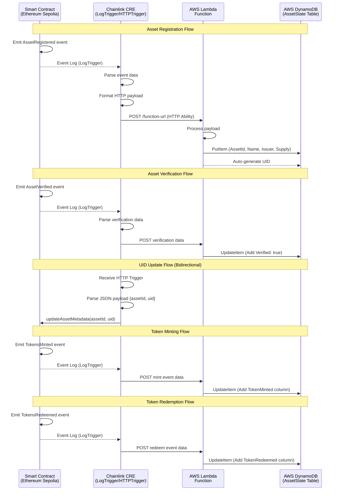

# Chainlink CRE LogTrigger and HTTP Ability Showcase

This repository demonstrates the integration of Chainlink Runtime Environment (CRE) with LogTrigger and HTTP abilities to enable seamless off-chain data orchestration for tokenized assets. The project tokenizes various real-world assets (RWAs) using Ethereum Solidity smart contracts and leverages Chainlink CRE, AWS DynamoDB, and Lambda functions to track the full lifecycle of these tokenized assets.

## Canonical Repository

This repository is the **canonical and fully DevRel-maintained source of truth** for these templates.

The code originally lived in [`smartcontractkit/cre-demo-dapps`](https://github.com/smartcontractkit/cre-demo-dapps), and was later consolidated here to provide a single, long-term maintained codebase.

All ongoing development and updates now happen exclusively in this repository, in order to avoid fragmentation and to preserve discoverability via search engines and AI tooling.

## Content

- [Project Overview](#project-overview)
  - [Tokenization and Lifecycle Management](#tokenization-and-lifecycle-management)
- [Flow Diagram](#flow-diagram)
- [Getting Started](#getting-started)
  - [Prerequisites](#prerequisites)
  - [Usage Steps](#usage-steps)
- [Troubleshooting](#troubleshooting)

## Project Overview

### Tokenization and Lifecycle Management

The core of this project is an Ethereum-based Solidity smart contract that facilitates the tokenization of diverse asset classes, including invoices, Treasury bills (T-bills), loans, and carbon credits. Users interact with the contract via specialized functions to manage asset operations, such as:

- Register: Onboard a new asset into the system.
- Verify: Validate asset authenticity and compliance.
- Transfer: Execute peer-to-peer asset transfers.
- Redeem: Liquidate or burn tokens to redeem underlying value.

To support generalized use cases, regulators, auditors, and investors require robust monitoring and auditing capabilities for these tokenized assets and their associated operations. While on-chain data is immutable and verifiable via the blockchain, querying it directly is inefficient and lacks user-friendly interfaces due to the opaque nature of raw transaction logs.

This project addresses these challenges by employing Chainlink CRE to bridge on-chain events with off-chain storage and retrieval. Specifically:

- Chainlink CRE's LogTrigger captures events emitted by the tokenization platform contract.
- Extracted event data is parsed, normalized, and encapsulated into a structured HTTP payload.
- The HTTP Ability dispatches this payload as a RESTful API request to an AWS Lambda function.
- The Lambda function persists the processed data into an AWS DynamoDB NoSQL database, enabling efficient querying via secondary indexes and flexible schemas.

All critical orchestration logic—including LogTrigger configuration, HTTP request formatting, and error handling—is encapsulated within Chainlink CRE workflows, ensuring modular, reusable, and scalable deployment.

This architecture decouples on-chain immutability from off-chain accessibility, providing stakeholders with near-real-time visibility into asset lifecycles without compromising blockchain integrity.

## Flow Diagram



## Getting Started

### Prerequisites

Before proceeding, ensure the following are set up:

- Install CRE CLI: Follow the [steps](https://docs.chain.link/cre/getting-started/cli-installation/macos-linux) to install CRE CLI.
- Create a CRE acount: follow the [doc](https://docs.chain.link/cre/account/creating-account) to create CRE account.
- CRE account authentication: Follow [doc](https://docs.chain.link/cre/account/cli-login) to log in CRE account with CLI.
- [git](https://git-scm.com/book/en/v2/Getting-Started-Installing-Git)
- [Node.js](https://nodejs.org/en) (v18+ recommended) for script execution.
- [Bun JS package manager](https://bun.com/)
- Ethereum Sepolia testnet access (e.g., via Alchemy or Infura RPC endpoint).
- Sepolia test tokens (ETH and any required ERC-20/ERC-1155 tokens) for gas and interactions.
- [AWS](https://aws.amazon.com/console/) account (Free Tier eligible) with IAM roles for DynamoDB and Lambda. <b>Steps are below</b>.

### Usage Steps

Follow these steps to deploy and interact with the project:

1. git clone the repo

    ```bash
    git clone https://github.com/smartcontractkit/cre-templates.git
    cd cre-templates/starter-templates/tokenized-asset-servicing/
    ```

2. Update Configuration Files

    You can update the Ethereum Sepolia RPC url with yours or directly use the default one in the `project.yaml`. The `project.yaml` should look like this:

    ```yaml
    local-simulation:
    rpcs:
        - chain-name: ethereum-testnet-sepolia
        url: https://por.bcy-p.metalhosts.com/cre-alpha/xxxxxx/ethereum/sepolia
    ```

3. Deploy Smart Contracts and add addr to config

    Change to directory contract and run the command to install dependencies

    ```bash
    npm install
    ```

    The contract source code can be found in [TokenizedAssetPlatform.sol](contracts/TokenizedAssetPlatform.sol). To deploy the contract to **Ethereum Sepolia testnet**, run the command

    ```bash
    npx tsx ./1_deploy.ts 
    ```

    The expected output is like below:

    ```bash
    deploy tx Hash: 0xc6cd10dfbc9619eb4a2d4d4524dc2e346895286145b5787318ad714211b93f1a
    Contract TokenizedAssetPlatform deployed successfully...
    Contact deployed at: 0x9bfe80ef1d5673f7b1f8ecafa67abc38e2164756
    Block number: 10077029n
    ```

    Execute the following commands to create a `config.json` file from the provided example.

    ```bash
    cd ../asset-log-trigger-workflow
    cp config.json.example config.json
    ```

    Update `assetAddress` in the [config.json](asset-log-trigger-workflow/config.json) file with the deployed contract address. The updated config file should have the evms config as below:

    ```json
    "evms": [
        {
        "assetAddress": "<YOUR DEPLOYED CONTRACT ADDR>",
        "chainSelectorName": "ethereum-testnet-sepolia",
        "gasLimit": "1000000"
        }
    ]
    ```

4. Create DynamoDB Table

    Go to the [AWS Management Console](https://aws.amazon.com/console/) and click "Sign in to console" to log into the AWS Management Console.

    

    Use Email to login or sign up.
    

    Search for DynamoDB in the search bar.
    

    Create table named `AssetState` with a partition key: AssetId(string). Leave other settings as default and click the orange button "create" on the down right. Page to create DynamoDB table is as below:
    

5. Create Lambda Function

    Search lambda function in AWS dashboard search bar and go to lambda dashboard.
    

    Create a new function by clicking "create function" on the top right. For this demo, set the function name to `Asset-lambda-function`. Set the runtime to nodejs.22 (this is also the default) as below.
    

    Click button "Create function" on the down right to init this lambda function. You will be at lambda dashboard when it is initiated successfully, and copy the file [index.mjs](lambda-function/index.mjs) and paste it in index.mjs under tab "Code".

    **NOTE 1: You need to update script with correct region, for example "us-east-1". Make sure the variable `yourAwsRegion` is assigned. You can find the region on the top right**

    **NOTE 2: Update the value of TABLE_NAME if you DID NOT use `AssetState` for dynamoDB table in last step**

    Once the `yourAwsRegion` and `TABLE_NAME` are assigned correctly, click blue button "deploy" on the left to deploy the lambda function.
    
    

    When the code is deployed, go to "Configuration" -> "Function URL" and click the button "Create function URL" to create a URL for the function. Choose "NONE" for the the Function URL's Auth type and click the button "save" on the down right. The page is like below:
    

    Add the lambda Function URL it to file `asset-log-trigger-workflow/config.json`. Function URL can be found under Configuration of AWS lambda function.
    

    Add function URL to "url" in the file:

    ```json
    "url": "<YOUR LAMBDA FUNCTION URL>",
    ```

    Grant the lambda function full permission to DynamoDB so that the function can read and update data in DynamoDB table. Search "IAM" in search bar and click "Role" on the left panel, and find and click the role for your lambda function(usually the name of the role starts with your lambda function name).
    

    Add permission to the role. Click the "Add permissions"->"Attach policies". In the policy page, select permission policy "AmazonDynamoDBFullAccess" and click "Add Permission" to add the policy to the role.
    

    You will find the "AmazonDynamoDBFullAccess" under the role if it is added successfully.
    

6. Install node dependencies

   From the `asset-log-trigger-workflow` directory, install node deps for the workflow with command below:

    ```shell

    bun install
    ```

    You will see the following if the process succeeds.

    ```bash
    $ bunx cre-setup
    [cre-sdk-javy-plugin] Detected platform: darwin, arch: arm64
    [cre-sdk-javy-plugin] Using cached binary: /Users/qingyangkong/.cache/javy/v5.0.4/darwin-arm64/javy
    ✅ CRE TS SDK is ready to use.

    + @types/bun@1.2.21
    + @chainlink/cre-sdk@0.0.8-alpha
    + viem@2.34.0
    + zod@3.25.76

    30 packages installed [3.06s]
    ```

7. Create a `.env` file from the example

    Create a new `.env` file from the provided example.

    ```bash
    cd ..
    cp .env.example .env
    ```

    This file is used to save the environment variables used in the workflow. Add your private key (without the 0x prefix) to the .env file like below:

    ```bash
    CRE_ETH_PRIVATE_KEY=<YOUR PRIVATE KEY>
    # Profile to use for this environment (e.g. local-simulation, production, staging)
    CRE_TARGET=local-simulation
    ```

8. Register an Asset

    Call the function `registerAsset` of deployed TokenizedAssetPlatform contract with command (make sure you are in directory contracts)

    ```bash
    npx tsx ./2_registerNewAsset.ts
    ```

    The expected result is

    ```bash
    ...
    Asset Registration Transaction sent! Hash: 0x9e4dd921384351c303d345e26c475552e39e5e7300296cd7cb958b517ab81ebb
    Transaction successful!
    ...
    ```

    Note the hash and it needs to be used in next step.

    cd to root directory and run command below to trigger the CRE with a specific event log.

    ```shell
    cd ../asset-log-trigger-workflow
    cre workflow simulate asset-log-trigger-workflow --broadcast --target local-simulation
    ```

    **NOTE CRE workflow simulate performs a dry run for onchain write operations. It will simulate the transaction and return a successful response, but will not broadcast it to the network, resulting in an empty transaction hash (0x). To execute a real transaction, `--broadcast` flag has to be in the command.**

    Because there are 2 triggers: logTrigger and httpTrigger within this CRE workflow, you need to select the correct one by input 1. You will see below in your terminal:

    ```bash
    🚀 Workflow simulation ready. Please select a trigger:
    1. evm:ChainSelector:16015286601757825753@1.0.0 LogTrigger
    2. http-trigger@1.0.0-alpha Trigger

    Enter your choice (1-2): 1
    ```

    Enter the deployment transaction hash and 1 for index in the terminal. There are 2 events in the transaction(`RoleGranted` and `AssetRegistered`) and index number 1 means we use the second event(`AssetRegistered`) in the transaction to trigger CRE. Example is like below:

    ```shell
    Enter transaction hash (0x...): 0x495df84e1d1d2dc382671dd96c4ce5f407f726f5a63bff3cd81c47969508f042
    Enter event index (0-based): 1
    ```

    By running this command, we actually trigger CRE with an event log in the transaction. In this case, it is simulated that CRE is monitoring a specific event log and then send a request to AWS lambda function. lambda function published before will make a new put in the DynamoDB.

    In the DynamoDB dashboard, click "Explore items" and you will see a new record in table "AssetState". AssetId is added to the record as partition key. AssetName, Issuer and Supply are values extracted from event log. Uid is generated automatically in the Lambda function.  
    

9. Verify an Asset

    Call the function `verifyAsset` of deployed TokenizedAssetPlatform contract with command (make sure you are in directory contracts)

    ```bash
    npx tsx ./3_verifyAsset.ts
    ```

    The expected result is:

    ```bash
    ...
    Asset Verification Transaction sent! Hash: 0xd94f290428c51b8e4046e14f1ccbda83249d96422dd88d8b5d61e3f8f87a2fda
    Transaction successful!
    ...
    ```

    Note the hash and it needs to be used in next step.

    run command below to trigger the CRE with event log.

    ```shell
    cd ../asset-log-trigger-workflow/
    cre workflow simulate asset-log-trigger-workflow --broadcast --target local-simulation
    ```

    Select LogTrigger by input 1.

    ```bash
    🚀 Workflow simulation ready. Please select a trigger:
    1. evm:ChainSelector:16015286601757825753@1.0.0 LogTrigger
    2. http-trigger@1.0.0-alpha Trigger

    Enter your choice (1-2): 1
    ```

    Enter hash of the verification transaction and index 0 in the terminal. A new column "Verified" is created and added on the same record. Example is like below:

    ```shell
    Enter transaction hash (0x...): 0xc11ca0c706f4897b16ca94c5225fbd0982ebcf4a2972b7536378f3c209abbe10
    Enter event index (0-based): 0
    ```

    In the DynamoDB, refresh the table and you will see a new boolean column Verified and it is set as true.
    

10. Update Asset Uid on smart contract through httpTrigger

    In this step, we are using httpTrigger to update the uid of a registered asset. The uid is auto-generated by lambda function when an asset is added into DynamoDB.

    It is possible to fetch the data from DynamoDB with a specific assetId and then send a RESTful request to CRE. CRE can decode the request and write the asset's uid to smart contract.

    run command below to trigger the CRE with event log.

    ```shell
    cre workflow simulate asset-log-trigger-workflow --broadcast --target local-simulation
    ```

    Select HttpTrigger by input 2.

    ```bash
    🚀 Workflow simulation ready. Please select a trigger:
    1. evm:ChainSelector:16015286601757825753@1.0.0 LogTrigger
    2. http-trigger@1.0.0-alpha Trigger

    Enter your choice (1-2): 2
    ```

    In a real use case, the request is sent from an off-chain service like lambda function. If the action in POST request to lambda function is defined as "sendNotification", a new POST request can be composed and sent to CRE. You can read the scripts of "sendNotification" in [index.mjs](./lambda-function/index.mjs).

    But in the demo, we are using simulation mode, and the CRE is running in local machine instead of being deployed on Chainlink service. There is not an apiUrl to receive the request, so we simulate the http request by sending CRE a [json payload](./asset-log-trigger-workflow/http_trigger_payload.json). You need to ensure your EVM account has Sepolia ETH for gas fee.

    ```json
    Enter your input: { "assetId": 1, "uid": "bca71bc9-d08e-48ef-8ad1-acefe95505a9" }
    ```

    If the transaction succeeds, you will see below in terminal:

    ```bash
    2025-10-30T22:23:34Z [USER LOG] Raw HTTP trigger received
    2025-10-30T22:23:34Z [USER LOG] Payload bytes payloadBytes {"assetId":1,"uid":"bca71bc9-d08e-48ef-8ad1-acefe95505a9"}
    2025-10-30T22:23:34Z [USER LOG] Parsed HTTP trigger received payload {"assetId":1,"uid":"bca71bc9-d08e-48ef-8ad1-acefe95505a9"}
    2025-10-30T22:23:34Z [USER LOG] Asset ID is 1
    2025-10-30T22:23:34Z [USER LOG] Asset UID is bca71bc9-d08e-48ef-8ad1-acefe95505a9
    2025-10-30T22:23:34Z [USER LOG] Updating metadata for Asset State contract, address is: 0x20621a7d14f07100634fFE441630dba5d948676A
    2025-10-30T22:23:59Z [USER LOG] write report transaction succeeded: 0xeb588b676abd6677b8b12aba47e065b749da9d585ffe7aa21e59641f06cbd04a
    ```

    For example, `0xeb588b676abd6677b8b12aba47e065b749da9d585ffe7aa21e59641f06cbd04a` in the log is the hash to forward the request to tokenization contract. You can check the hash on Sepolia Etherscan to see more details.

    Run command below to check the updated uid value (make sure run the command in folder contracts)

    ```bash
    npx tsx ./4_readUid.ts
    ```

    You will see the result as below. The value is the same as the uid in the JSON payload. This was updated on tokenization contract.

    ```bash
    Extracted UID: bca71bc9-d08e-48ef-8ad1-acefe95505a9
    ```

    The extracted UID will be uid value in our JSON payload. This means the value in the payload that sent to the CRE is extracted correctly and written into the smart contract.

11. Mint Tokens

    Call the function `mint` of deployed TokenizedAssetPlatform contract with command (make sure you are in directory contracts)

    ```bash
    npx tsx ./5_mint.ts
    ```

    the expected result is:

    ```bash
    ...
    Mint Transaction sent! Hash: 0x963102841c7f13cc398564ce8d800226760599de1873f737678c98487a90ed02
    Transaction successful!
    ...
    ```

    run command below to trigger the CRE with event log.

    ```shell
    cd ../asset-log-trigger-workflow/
    cre workflow simulate asset-log-trigger-workflow --broadcast --target local-simulation
    ```

    Select LogTrigger by input 1.

    ```bash
    🚀 Workflow simulation ready. Please select a trigger:
    1. evm:ChainSelector:16015286601757825753@1.0.0 LogTrigger
    2. http-trigger@1.0.0-alpha Trigger

    Enter your choice (1-2): 1
    ```

    Enter hash of the mint transaction and 1 as index in the terminal. Column TokenMinted is created and added on the record. Example is like below:

    ```shell
    Enter transaction hash (0x...): 0x578032166b30ea921b0fb38e415bd1dd153edec899e05e07568953750f8dbff0
    Enter event index (0-based): 1
    ```

    In the DynamoDB, you will see column TokenMinted added and the value of the column is the same as value in event log.
    

12. Redeem Tokens

    Call the function `mint` of deployed TokenizedAssetPlatform contract with command (make sure you are in directory contracts)

    ```bash
    npx tsx ./6_redeem.ts
    ```

    the expected result is:

    ```bash
    ...
    Redeem Transaction sent! Hash: 0x11853cf396f366e9e1d6787d9234fa0af8e53851964356d0997727e8e9b36d66
    Transaction successful!
    ...
    ```

    run command below to trigger the CRE with event log.

    ```shell
    cd ../asset-log-trigger-workflow/
    cre workflow simulate asset-log-trigger-workflow --broadcast --target local-simulation
    ```

    Select LogTrigger by input 1.

    ```bash
    🚀 Workflow simulation ready. Please select a trigger:
    1. evm:ChainSelector:16015286601757825753@1.0.0 LogTrigger
    2. http-trigger@1.0.0-alpha Trigger

    Enter your choice (1-2): 1
    ```

    Enter hash of the redeem transaction and 1 for index in the terminal. Example is like below:

    ```shell
    Enter transaction hash (0x...): 0xc6764610b2886dc91b73c388407a6bd9920a3c0f176fae23070b3cb992fdc8c1
    Enter event index (0-based): 1
    ```

    In the DynamoDB, you will see a new record put. In this record put, column TokenRedeem is created and added on the same record.
    

# Troubleshooting

- AWS Lambda Internal Server Error on Invocation

    Verify that the Lambda execution role has the necessary IAM permissions for DynamoDB operations (e.g., dynamodb:PutItem, dynamodb:UpdateItem). Attach a policy like AmazonDynamoDBFullAccess temporarily for debugging, then refine to least-privilege principles. Check CloudWatch Logs for detailed error traces.

- Chainlink CRE Fails to Detect Events

    Transactions may emit multiple events in sequence; ensure the LogTrigger targets the correct event index. For instance, during asset registration, two events are emitted—the second (AssetRegistered) is the trigger. Adjust the workflow's eventIndex parameter accordingly. Use Etherscan to inspect raw logs and correlate with CRE configuration.

- Solidity Compilation Errors (Override Mismatch or Inheritance Issues)

    These often stem from version incompatibilities in OpenZeppelin contracts. Use OpenZeppelin v5.x for ERC-1155 implementations explicitly if Remix uses other versions of OZ contracts.
